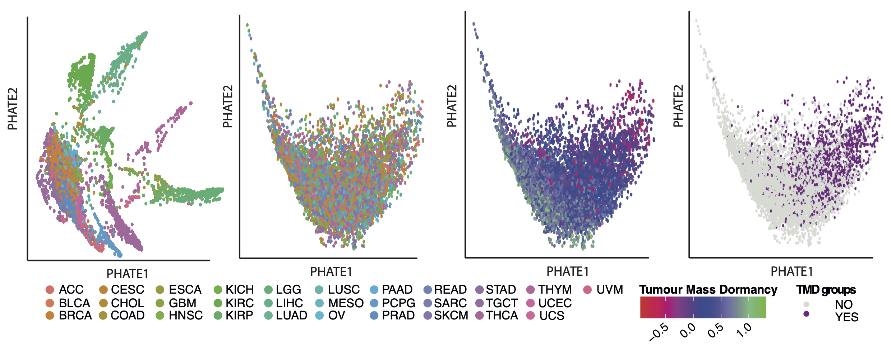

# Tumour mass dormancy quantification

This repository contains the workflow for tumour mass dormancy quantification across TCGA cancers.

# Table of contents

## ApobecEnrichmentAnalysis

This folder contains the code which establishes how the tumour mass dormancy and exhaustion programmes are predictive of enrichment of APOBEC mutational signatures.

- ApobecEnrich_define.R: Runs iterations of tSNE and expectation-maximization clustering to create Apobec mutational signature enrichment labels, and compare them to established Apobec enrichment scores.
- RandomForest_100sims.R: Creates 100 random forests from balanced APOBEC-enriched/non-enriched samples, evaluates the overall predictive capacity of the models, and details gene importance.
- RandomForest_exemplary.R: Creates a single random forest using the method as detailed above, and runs further visualisation, including association with normalised PLG expression (Fig 4F) and the corresponding multidimensional scaling plot (Fig 4G). Finally, runs Wilcoxon tests to determine differences in median expressions between Apobec-enriched/non-enriched samples.
- Zscore_normalization.R: Runs standard Z-score normalisation on exemplary FPKM-normalised data.

# Copyright

This code is free and is distributed in the hope that it will be useful, but WITHOUT ANY WARRANTY. See the GNU General Public License for more details.
